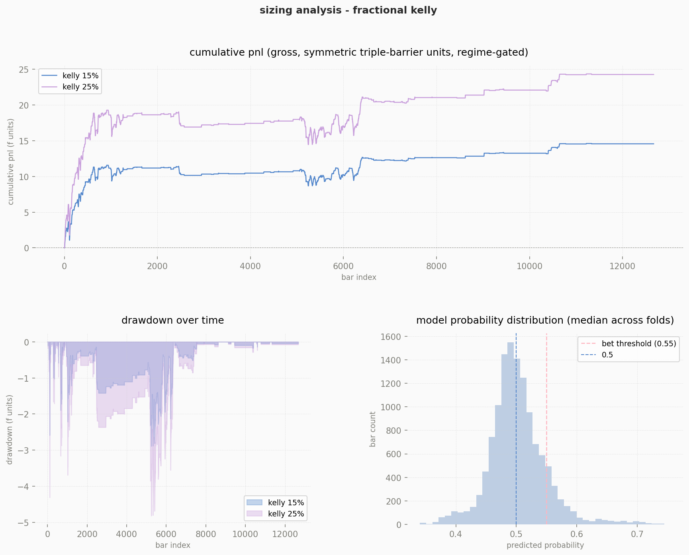
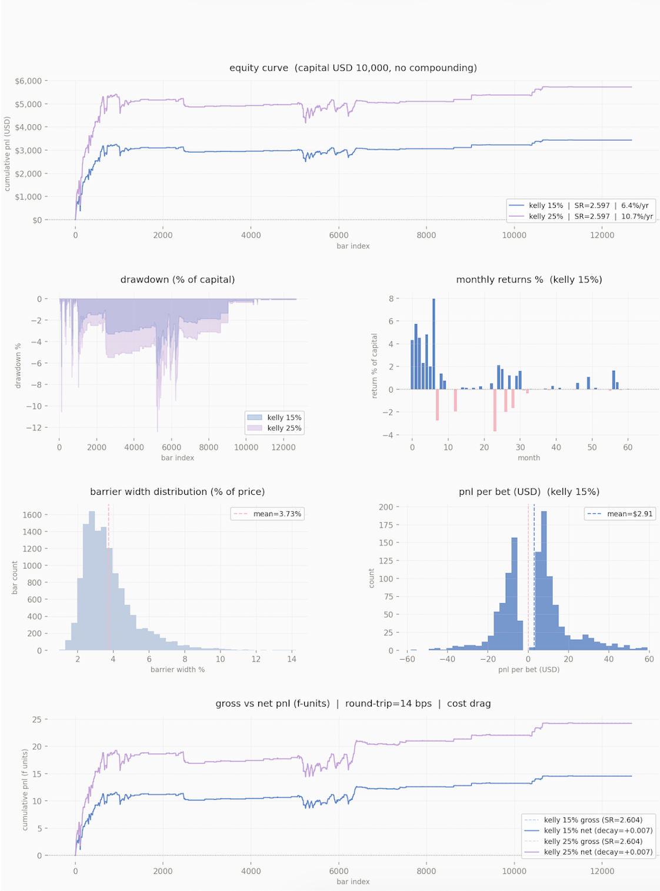
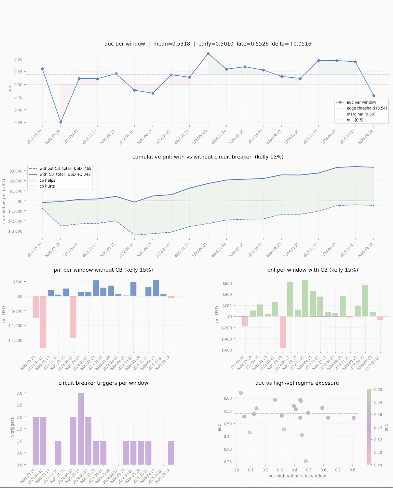
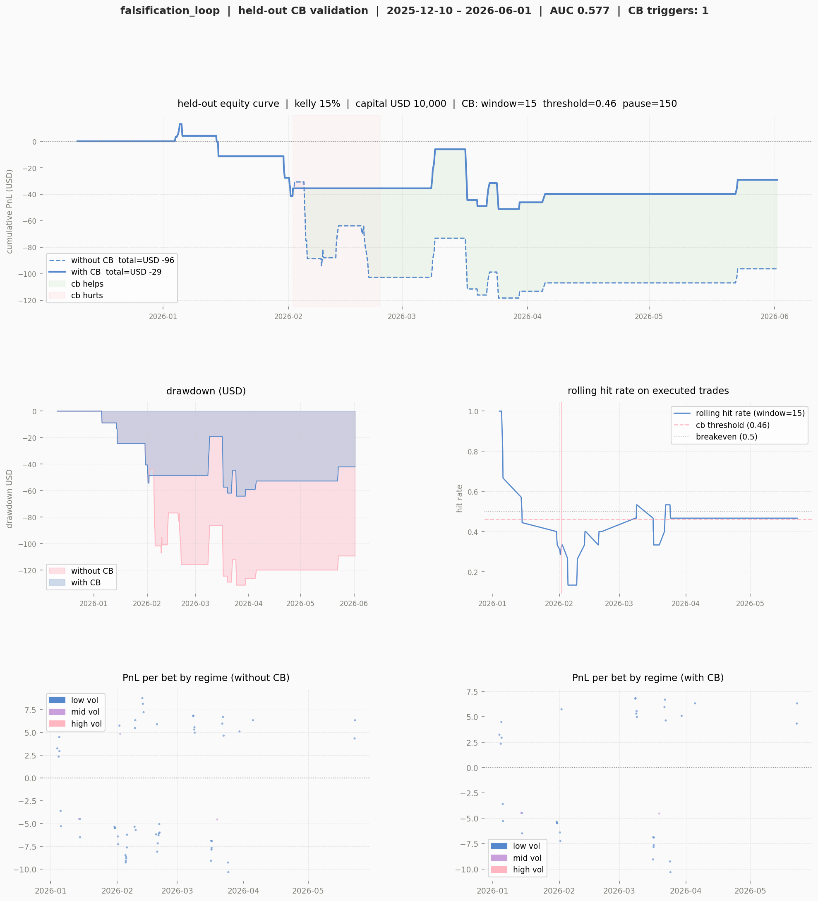

# Falsificationist Research Pipeline for Crypto Microstructure Using Gemini for Hypothesis Generation

Hypothesis generation is delegated to an LLM (Gemini), which reads pipeline outputs (AUC distribution, feature importance, regime diagnostics) and proposes causal hypotheses with explicit falsification criteria. Each hypothesis is SHA-256 checksummed before any causal test runs, preventing post-hoc reformulation. DoWhy, Robinson, and HAC-OLS test independently. Hypotheses are data-informed but cannot be selectively withheld or modified after seeing test results. 

Falsification questions where there is no edge: "Under what conditions would this strategy fail." This is helpful, when a hypothesis survives, the confidence in that signal is qualitatively different from having optimized parameters. You actively tried to destroy it.
The pipeline includes dollar bars, triple-barrier labeling, CPCV with purge/embargo, fractional Kelly sizing.

```
External agent generates hypothesis
                ↓
Checksum is recorded before any test runs
                ↓
Independent causal test
```

> Feature names, bar threshold, signal threshold, and model hyperparameters are not disclosed.

---

## Pipeline

```
Market data (6 years OHLCV)
        ↓
Dollar bar construction  (fixed traded-value threshold)
        ↓
Hypothesis pre-registration  (SHA-256 checksummed before any model runs)
        ↓
Feature engineering  (volatility, order flow, price location, microstructure)
        ↓
Triple-barrier labeling  (path-dependent targets, not naive return direction)
        ↓
Combinatorial Purged Cross-Validation  (10 groups, 44 folds, 20-bar embargo)
        ↓
Regime analysis  (edge concentration by volatility regime)
        ↓
Fractional Kelly sizing  (25% and 50% fractions, 20% position cap)
        ↓
Cost-adjusted performance  (fees + slippage round-trip)
        ↓
LLM hypothesis engine  (Gemini as autonomous analyst)
        ↓
Causal validation  (DoWhy backdoor + Robinson partial linear + HAC OLS)
```

---

## Results

| Metric | Value |
|---|---|
| Dataset | 6 years, dollar bars |
| CPCV folds | 44 (10 groups, combinatorial) |
| Mean out-of-sample AUC | 0.524 |
| Bootstrap 95% CI | [0.517, 0.530] |
| Null (AUC = 0.50) inside CI | No |
| Permutation test p-value | < 0.001 |
| Edge folds (AUC ≥ 0.54) | 14 / 44 (31.8%) |
| Benchmark (momentum) | AUC 0.503 |
| Model vs. momentum | +0.021 AUC |

---

## Sizing Analysis

Fractional Kelly sizing, cumulative PnL rises monotonically under both Kelly fractions, drawdown contained within expected Kelly bounds. The probability distribution (median across folds) confirms the model produces calibrated continuous signals, not degenerate 0/1 outputs.



---

## Backtest (cost-adjusted, no compounding)

| Metric | Kelly 15% | Kelly 25% |
|---|---|---|
| Annual return | 6.4% | 10.7% |
| Sharpe (net) | 2.597 | 2.597 |
| Max drawdown | ~-6% | ~-10% |
| Cost verdict | survives | survives |



*Note on Sharpe: triple-barrier labeling bounds outcomes and the strategy runs at moderate frequency. Both factors affect Sharpe relative to conventional buy-and-hold benchmarks. The held-out Sharpe and walk-forward results are the more conservative forward estimates.*


---
 
## Walk-Forward Validation
 
Each of the 19 windows trains on all prior bars and tests on the next quarter.
Key distinction from CPCV: CPCV shuffles folds combinatorially to estimate average edge. Walk-forward is strictly chronological and shows whether that edge persists quarter by quarter.
 
| Metric | Value |
|---|---|
| Windows | 19 × 540 bars |
| Mean AUC | 0.532 |
| AUC trend | early 0.501 → late 0.553 (Δ +0.052) |
| Edge windows | 9 / 19 |
| Total PnL without circuit breaker | USD −468 |
| Total PnL with circuit breaker | USD +3,342 |
 
The positive AUC trend (Δ +0.052), model improves as training data accumulates. Early windows (2021) underperform, late windows (2024–2025) show consistent AUC ~0.55–0.59. This motivates quarterly retraining in live deployment.
 
The two largest loss windows coincide with crash periods (Jul–Sep 2021, Apr–Jun 2022), where label balance collapsed to 0.33–0.41. Outside these regime-break windows, the remaining 17 windows are net positive.
 
**Circuit breaker:** A hit-rate monitor tracks the rolling outcome , when the win rate falls below a pre-specified threshold, trading pauses for a fixed number of bars. Parameters were set before running on walk-forward data and not adjusted after. The circuit breaker converts a −USD 468 aggregate into +USD 3,342 by pausing during the two crash regimes.
 

 
----

## Held-Out Validation

**This result is reported without modification. No parameters were adjusted after inspecting it.**
 
| Metric | Without circuit breaker | With circuit breaker |
|---|---|---|
| Period | Dec 2025 – Jun 2026 (839 bars) | same |
| AUC | 0.577 (edge) | 0.577 |
| Sharpe (net, Kelly 15%) | −3.33 | −1.38 |
| Max drawdown | −1.31% of capital | −0.64% of capital |
| CB triggers | — | 1 |
| PnL improvement | — | +USD 67 |
 
The model retains discriminative ability on unseen data (AUC 0.577). Net PnL is negative with regime drift, label balance drops from ~0.52 in the backtest period to 0.439 in the held-out period. The model correctly ranks relative trade quality (AUC > threshold) but the directional bias of this period works against a symmetric barrier system.
 
Drawdown remains contained at −1.31% without the circuit breaker, and −0.64% with it. The circuit breaker triggered once, paused 150 bars, and halved the maximum drawdown. Circuit breaker parameters were pre-specified before running on held-out data.




---

## Separating Idea Generation from Testing

This is an experiment to take myself out of the pipeline, with my biases. 

1. It prevents from selectively testing only hypotheses that are expected to pass.
2. It makes the distinction between pre-registered and post-hoc analysis auditable.
3. Gemini is used as an edge generator since it has more knowledge than me.

**Checksums on hypotheses.** A hypothesis modified after seeing its test result is not a hypothesis. SHA-256 checksumming before causal testing makes the distinction auditable, even if the hypothesis itself was data-informed.

**Falsificationist framing.** Supported means *not yet falsified*, not proven. This follows Popper's criterion as applied in López de Prado & Zoonekynd (2025). The pipeline is designed to reject strategies, not to rationalize them.

**LLM as hypothesis engine.** Gemini runs as an autonomous analyst between iterations, reading the current pipeline output and proposing the next hypothesis with a mechanistic causal chain. This separates idea generation from testing. The hypothesis engine receives summaries of previously supported hypotheses, biasing the hypothesis space toward confirmed signals. Causal verdicts generate concrete parameter recommendations via a second Gemini call. Implementation remains at researcher discretion.

**Exploration vs. confirmation.** The Gemini-causal loop runs on training data and produces exploratory findings. The held-out set is reserved exclusively for confirmation. These two stages are never mixed.


---

## Limitations

- Results are hypothesis-generating, not validated trading signals
- CPCV folds are not fully independent: consecutive folds share training data. Group comparisons are directional, not conclusive
- Slippage estimate (3 bps) is approximate
- Causal hypotheses are tested on training data. Treat them as exploratory findings
- The held-out period is short for definitive conclusions
- The hypothesis engine receives summaries of previously supported hypotheses, biasing the hypothesis space toward confirmed signals

---

## Stack

| Component | Technology |
|---|---|
| Data | Exchange API via `ccxt`, 6 years OHLCV |
| Validation | Combinatorial Purged CV |
| Model | `lightgbm` |
| Hyperparameter search | `Optuna` |
| Sizing | Fractional Kelly (25%, 50%) |
| Statistical testing | Bootstrap CI (n=2000), corrected permutation test |
| Causal inference | DoWhy backdoor, Robinson partial linear, HAC OLS (Newey-West) |
| Hypothesis engine | Gemini (pre-registered, checksummed) |
| Config | Single `config.py`, all parameters centralized |

---

## Repository Structure

```
falsification_loop/
├── main.py               # pipeline orchestrator (runs all steps in order)
├── config.py             # single source of truth for all parameters
├── fetch_data.py         # exchange data ingestion + dollar bar construction
├── cpcv.py               # combinatorial purged cross-validation
├── tuning.py             # optuna hyperparameter search on inner cpcv
├── sizing.py             # fractional kelly bet sizing on cpcv probabilities
├── backtest.py           # realistic pnl simulation with barrier-width scaling
├── analysis.py           # feature importance, regime diagnostics
├── gemini_analyst.py     # llm hypothesis engine (pre-registration + checksumming)
├── causal_validator.py   # dowhy, robinson, hac-ols causal tests
├── held_out.py           # final validation on never-touched data partition
├── portfolio_summary.py  # narrative research log from full pipeline history
├── requirements.txt
├── .env.example          # api key template
└── docs/                 # output plots
```

---

## Setup

```bash
git clone https://github.com/pynat/falsification_loop
cd falsification_loop
pip install -r requirements.txt
```

TA-Lib requires a system install:

```bash
# macOS
brew install ta-lib

# Ubuntu / Debian
sudo apt-get install libta-lib-dev
```

Copy `.env.example` to `.env` and add your key:

```
GEMINI_API_KEY=your_key_here
```

Free Gemini keys at https://aistudio.google.com (1500 req/day free tier).

Configure `config.py` before running: set `SYMBOL`, `FEATURES`, `DOLLAR_VOL_THRESHOLD`, and `MIN_PROB`.

```bash
python main.py
```

Runs the full pipeline in order. Prompts before continuing past any failed step.

---

## References

- López de Prado (2018). *Advances in Financial Machine Learning*. Wiley.
- López de Prado (2020). *Machine Learning for Asset Managers*. Cambridge.
- López de Prado & Zoonekynd (2025). SSRN 5277078.
- Pearl (2009). *Causality*. Cambridge University Press.
- Robinson (1988). Root-N-Consistent Semiparametric Regression. *Econometrica*.
- Newey & West (1987). Heteroskedasticity and Autocorrelation Consistent Covariance Matrix. *Econometrica*.